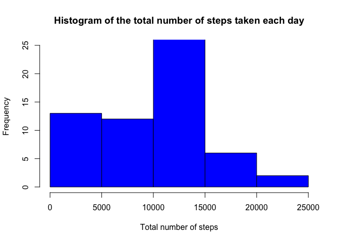
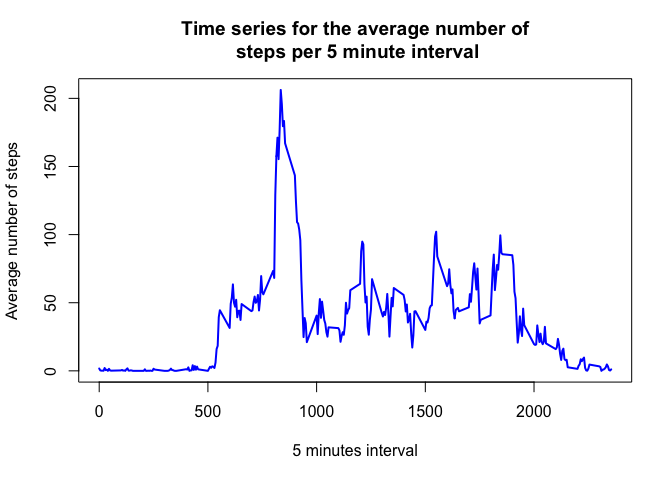
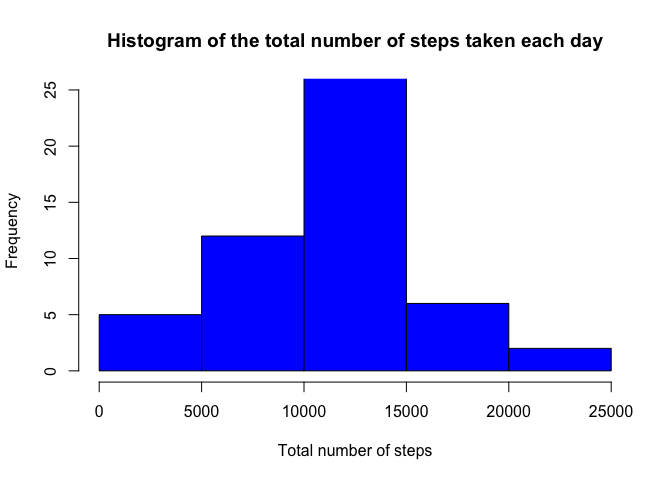
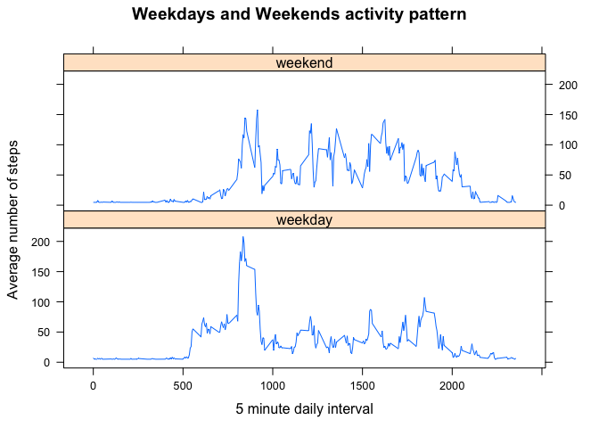

# Reproducible Research: Peer Assessment 1
Muhammad Hafiz Hasan  


## Loading and preprocessing the data

Load the data


```r
if(!file.exists('activity.csv')) {
  unzip("activity.zip")  
}

data.activity <- read.csv('activity.csv')
```

Transform date attribute to use ```weekdays``` function


```r
data.activity$date <- as.Date(data.activity$date, format = "%Y-%m-%d")
```

Populate into Data Frame and compute the weekdays from date attribute


```r
df.activity <- data.frame(date=data.activity$date,
                          weekday=tolower(weekdays(data.activity$date)),
                          steps=data.activity$steps,
                          interval=data.activity$interval)
```

Compute the day type (weekend or weekday)


```r
df.activity <- cbind(df.activity,
                     daytype=ifelse(df.activity$weekday == "saturday" |
                                      df.activity$weekday == "sunday", "weekend",
                                    "weekday"))
```

## What is mean total number of steps taken per day?

Calculate the mean


```r
mean.daily.steps <- tapply(df.activity$steps, df.activity$date, sum, na.rm=TRUE)
```

Calculate total daily steps


```r
total.daily.steps <- aggregate(df.activity$steps, by=list(df.activity$date), FUN=sum, na.rm=TRUE)

names(total.daily.steps) <- c('date', 'total')
```

Histogram of the total number of steps taken each day


```r
hist(total.daily.steps$total,
     col="blue",
     xlab="Total number of steps",
     ylim=c(0,25),
     main="Histogram of the total number of steps taken each day")
```

 

Calculate mean and median total number of steps taken per day


```r
mean(total.daily.steps$total)
```

```
## [1] 9354.23
```

```r
median(total.daily.steps$total)
```

```
## [1] 10395
```

## What is the average daily activity pattern?

Average daily activity pattern


```r
daily.average <- aggregate(df.activity$steps,
                           by=list(df.activity$interval),
                           FUN=mean,
                           na.rm=TRUE)

names(daily.average) <- c("interval", "mean")
```

Time series plot of the 5-minute interval (x-axis) and the average number of steps taken, averaged across all days (y-axis)


```r
plot(daily.average$interval,
     daily.average$mean,
     type="l",
     col="blue",
     lwd=2,
     xlab="5 minutes interval",
     ylab="Average number of steps",
     main="Time series for the average number of\n steps per 5 minute interval")
```

 

Maximum number of steps


```r
mean.max <- which(daily.average$mean == max(daily.average$mean))
max.interval <- daily.average[mean.max,1]
max.interval
```

```
## [1] 835
```

## Imputing missing values

Count missing values (NA)


```r
na.count <- sum(is.na(df.activity$steps))
na.count
```

```
## [1] 2304
```

Get missing values (NA) positions


```r
na.position <- which(is.na(df.activity$steps))
```

Steps mean value will be used for filling all missing values and populate as vector


```r
mean.vector <- rep(mean(df.activity$steps, na.rm=TRUE), times=length(na.position))
```

Create new dataset similar with original dataset and fill up all the missing values


```r
df.activity.complete <- df.activity
df.activity.complete[na.position, "steps"] <- mean.vector
```

Histogram of the total number of steps taken each day


```r
sum.daily.steps <- aggregate(df.activity.complete$steps, by=list(df.activity.complete$date), FUN=sum)

names(sum.daily.steps) <- c("date", "total")

hist(sum.daily.steps$total,
     col="blue",
     xlab="Total number of steps",
     ylim=c(0,25),
     main="Histogram of the total number of steps taken each day")
```

 

Calculate mean and median


```r
mean(sum.daily.steps$total)
```

```
## [1] 10766.19
```

```r
median(sum.daily.steps$total)
```

```
## [1] 10766.19
```

## Are there differences in activity patterns between weekdays and weekends?

We can just reuse dataset ```df.activity.complete``` and split as weekday and weekend dataset


```r
df.weekday <- df.activity.complete[df.activity.complete$daytype=="weekday",]
df.weekend <- df.activity.complete[df.activity.complete$daytype=="weekend",]
```

Compute mean interval for weekday and weekend


```r
library(dplyr)
library(data.table)
```


```r
dt.weekday <- data.table(df.weekday)
weekday.interval <- group_by(dt.weekday, interval)
mean.weekday.interval <- summarize(weekday.interval, mean(steps))
setnames(mean.weekday.interval,"mean(steps)","mean")

dt.weekend <- data.table(df.weekend)
weekend.interval <- group_by(dt.weekend, interval)
mean.weekend.interval <- summarize(weekend.interval, mean(steps))
setnames(mean.weekend.interval,"mean(steps)","mean")
```

Combine dataset weekday and weekend, add weekday column to differentiate


```r
mean.weekday.interval <- mutate(mean.weekday.interval, weekday = "weekday")
mean.weekend.interval <- mutate(mean.weekend.interval, weekday = "weekend")

combined.steps <- bind_rows(mean.weekday.interval, mean.weekend.interval)
```

Plot the graph


```r
library(lattice)
```


```r
xyplot(mean ~ interval | weekday, data = combined.steps, type = "l", layout = c(1,2), main = "Weekdays and Weekends activity pattern", xlab = "5 minute daily interval", ylab = "Average number of steps")
```

 

More steps activity happens on weekend than on weekday. However, the most intense steps happens during weekdays.  
  
  
  
----
